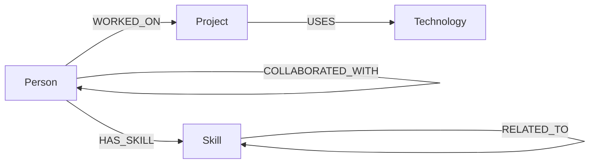

# SkillGraph

SkillGraph is a small graph exploration application built for the Wexa AI CognoDB take-home assignment. It helps a non-technical user discover how people, skills, projects, and technologies connect.

## Live demo

**https://skillgraph-tawny.vercel.app**

## Why a graph database?

The valuable questions in this use case are relationship questions: who worked on projects that use a technology, which skills connect collaborators, and who might be a useful person to involve based on shared skills in a collaboration network.

A relational database can store these facts, but connected discovery quickly becomes a chain of joins across people, projects, technologies, skills, and collaboration tables. In a graph, the relationships are first-class and the query can directly follow paths such as `Person -> WORKED_ON -> Project -> USES -> Technology` or `Person -> COLLABORATED_WITH -> Person -> HAS_SKILL -> Skill`. This makes multi-hop exploration easier to express and easier to extend with new relationship types.

## Graph data model



### Node labels

- `Person`: id, name, role
- `Skill`: name
- `Project`: id, name, description
- `Technology`: name

### Relationship types

- `HAS_SKILL`: Person → Skill
- `WORKED_ON`: Person → Project
- `USES`: Project → Technology
- `COLLABORATED_WITH`: Person ↔ Person
- `RELATED_TO`: Skill ↔ Skill

The seed script is idempotent: it uses `MERGE` for logical entities and relationships, so it can safely be run again without first deleting the database.

## Main Cypher queries

### Multi-hop traversal

```cypher
MATCH (p:Person {id: $personId})
      -[:WORKED_ON]->(project:Project)
      -[:USES]->(technology:Technology)
RETURN project.name AS project, technology.name AS technology
ORDER BY project, technology;
```

This is the core `2-hop` traversal required by the assignment.

### Graph-heavy discovery

```cypher
MATCH (p:Person)-[:WORKED_ON]->(project:Project)-[:USES]->(technology:Technology)
WHERE technology.name = $technology
RETURN p.name AS person, collect(DISTINCT project.name) AS projects
ORDER BY person;
```

This is relationship-oriented discovery: it finds every person connected to a technology through their project history. The application exposes this interaction as technology filters.

### Graph-native recommendation

```cypher
MATCH (p:Person {id: $personId})
      -[:COLLABORATED_WITH]->(colleague:Person)
      -[:HAS_SKILL]->(skill:Skill)
      <-[:HAS_SKILL]-(candidate:Person)
WHERE candidate <> p
RETURN candidate.name AS candidate, collect(DISTINCT skill.name) AS sharedSkills
ORDER BY size(sharedSkills) DESC, candidate;
```

This is intentionally awkward for a traditional relational model because it follows several relationship hops and compares people through the skills of their collaborators.

All application Cypher is parameterized through the official Neo4j JavaScript driver. No user input is concatenated into Cypher strings.

## Architecture

```text
Browser
  │
  ▼
Next.js App Router UI
  │
  ▼
/api/graph Route Handler
  │
  ▼
Official neo4j-driver
  │
  ▼
CognoDB Cloud (Bolt + openCypher)
```

The browser never receives database credentials. The server-side Route Handler reads `COGNODB_URI`, `COGNODB_USERNAME`, and `COGNODB_PASSWORD` from environment variables.

## Features

- Live graph statistics loaded from CognoDB
- Search across people, projects, and technologies
- Technology filters that execute graph queries
- Multi-hop project → technology path visualization
- Person detail view with skills, projects, and collaborators
- Loading, empty, and database-error states
- Responsive UI for desktop and mobile
- Idempotent seed script
- Parameterized Cypher examples in `cypher/queries.cypher`

## Stack

- Next.js 15 + TypeScript
- React 19
- Official Neo4j JavaScript driver
- CognoDB Cloud
- Vercel

## Local setup

### 1. Create CognoDB

Create a free instance at `https://console.cognodb.com/signup` and save the generated password when it is shown. CognoDB exposes a Bolt URI similar to:

```text
bolt+s://<instance-id>.databases.cognodb.cloud
```

### 2. Configure environment variables

Copy `.env.example` to `.env.local` and fill in:

```env
COGNODB_URI=bolt+s://your-instance-id.databases.cognodb.cloud
COGNODB_USERNAME=cognodb
COGNODB_PASSWORD=your-password
```

Never commit `.env.local` or any real password.

### 3. Install and run

```bash
npm install
npm run seed
npm run dev
```

Open `http://localhost:3000`.

### 4. Production build

```bash
npm run lint
npm run build
npm start
```

## Seed data

`scripts/seed.ts` creates realistic connected data including:

- 8 people
- 10 skills
- 5 projects
- 8 technologies
- project/work relationships
- collaboration relationships
- skill relationships

The script uses parameterized `UNWIND` data and `MERGE`, making it safe to rerun.

## Environment and security

Connection details are environment variables only. The repository contains `.env.example`, never live secrets. Vercel stores the production values in its Environment Variables settings.

## Error handling

If CognoDB cannot be reached, the API returns HTTP `503` with a user-safe message. The UI displays a clear connection-error state and a retry action rather than exposing driver errors or credentials.

## Deployment

The repository is deployed on Vercel. Configure these environment variables in the Vercel project for Production (and Preview if desired):

- `COGNODB_URI`
- `COGNODB_USERNAME`
- `COGNODB_PASSWORD`

Every push to `main` can trigger a new Vercel deployment when the GitHub integration is enabled.

## Screenshots

### Dashboard


### Technology graph exploration


### Person profile


## Screen recording

**Required before submission:** record a short 60–120 second walkthrough showing:

1. Open the live demo.
2. Search for a person or technology.
3. Apply a technology filter.
4. Show the `Person → Project → Technology` path.
5. Open a person and show connected skills/projects/collaborators.

Paste the recording link here before emailing Wexa.

## Submission checklist

- [x] GitHub repository
- [x] CognoDB-backed application
- [x] Thoughtful graph model
- [x] Seed script
- [x] Parameterized Cypher
- [x] Multi-hop traversal
- [x] Relationally awkward graph query
- [x] Functional web UI
- [x] Loading/empty/error states
- [x] Environment-based secrets
- [x] Graceful database failure
- [x] Hosted Vercel demo
- [x] Final screenshots
- [ ] Short screen recording link
- [ ] Final review of live CognoDB data
